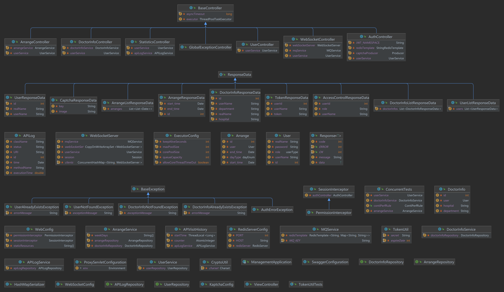

## 测试报告

王嘉豪 3190105304

### 1 引言

#### 1.1 编写目的

需求分析报告、设计报告描述了“互联网医院管理系统”的软件功能性需求和非功能性需求以及大致的设计框架、API等。本文档旨在对“互联网医院管理系统”的”后台管理“子模块进行测试与评估，对开发人员的工作做总体评估，对产品质量性能进行评估。

#### 1.2 背景

互联网医疗，是互联网在医疗行业的新应用，其包括了以互联网为载体和技术手段的健康教育、医疗信息查询、电子健康档案、疾病风险评估、在线疾病咨询、电子处方、远程会诊、及远程治疗和康复等多种形式的健康医疗服务。互联网医疗，代表了医疗行业新的发展方向，有利于解决中国医疗资源不平衡和人们日益增加的健康医疗需求之间的矛盾，是卫生部积极引导和支持的医疗发展模式。互联网医疗浪潮滚滚，尤其是近几年疫情轮番挑战着医疗系统，医疗信息上云、互联网医疗管理的需求越来越显著。对于患者来说，迫切需要一个网上查询医院信息的平台，能够快捷地查询到相关科室信息、相关医生信息，能够针对医院网站公示的医生专攻领域以及患者评价，做出自己的求医选择；对于医生来说，需要一个便捷的平台与患者进行沟通，能够满足患者对于简单线上问询的需求；对于医院管理来说，需要一个医生信息管理系统，能够对医院医生信息进行登记记录，便于各种管理需求，同时也需要一个排班系统，以便对患者的预约需求进行满足，帮助医生最大化利用时间，救治更多的病人。

为了帮助医院进行信息化改革，改善患者就医体验，减轻医生问诊负担，我们集思广益做了一个互联网医院管理系统，分为”挂号预约“、”药房系统“、”医生查询“、”后台管理“等。本文档对其中“后台管理”模块进行测试。

#### 1.3 定义

功能测试：也称为行为测试，根据产品特征、操作描述和用户方案，测试一个产品的特性和可操作行为以确定它们满足设计需求。本地化软件的功能测试，用于验证应用程序或网站对目标用户能正确工作。使用适当的平台、浏览器和测试脚本，以保证目标用户的体验将足够好，就像应用程序是专门为该市场开发的一样。边界测试：边界测试用来探测和验证代码在处理极端的或偏门的情况时会发生什么。
压力测试：软件压力测试是一种基本的质量保证行为，它是每个重要软件测试工作的一部分。软件压力测试的基本思路很简单：不是在常规条件下运行手动或自动测试，而是在计算机数量较少或系统资源匮乏的条件下运行测试。通常要进行软件压力测试的资源包括内部内存、CPU 可用性、磁盘空间和网络带宽。
接口测试：接口测试的目的是测试接口（外部的或内部的），尤其是那些与系统相关联的外部接口。测试的重点是要检查数据的交换，传递和控制管理过程，还包括处理的次数。外部接口测试一般是作为系统测试来看待的。
边界值分析：边界值分析法就是对输入或输出的边界值进行测试的一种黑盒测试方法。通常边界值分析法是作为对等价类划分法的补充，这种情况下，其测试用例来自等价类的边界。

### 2 测试概要

根据需求分析报告、设计报告中所确定的功能模块，以及测试本身会涉及到的方面，拟从以下角度对该软件做出详细的测试，在接下来的测试文档里，将会对各种功能模块进行测试，在模块中，会涵盖表中所示的测试内容。

| 测试项目名称 | 测试目的                                           | 测试内容                                                     |
| ------------ | -------------------------------------------------- | ------------------------------------------------------------ |
| 类测试       | 针对具体实现测试每个模块类功能是否正常             | 管理员用户类 医生信息类 排班信息类                 |
| 功能验证测试 | 利用黑盒测试系统功能是否齐全，各个功能是否正确执行 | 登录 查看用户数据 查看医生信息 添加医生信息 删除医生信息 查看排班信息 添加排班信息 删除排班信息  |
| 边界测试     | 测试程序对边界情况是否正确处理                     | 登录 查看用户数据 查看医生信息 添加医生信息 删除医生信息 查看排班信息 添加排班信息 删除排班信息  |
| 压力测试     | 测试系统在高负载情况下的功能和性能的承受情况       | 登录 查看用户数据 查看医生信息 添加医生信息 删除医生信息 查看排班信息 添加排班信息 删除排班信息  |
| 用户接口测试 | 测试用户能否通过网页界面完成想要执行的操作         | 登录界面 注册界面 主界面 医生管理子界面       |

### 3 面向对象测试

#### 3.1 系统整体架构

后台管理子系统后端对应的Java类图如下：

#### 3.2 具体类测试

##### 管理员用户类

| 测试内容                 | 测试结果 |
| ------------------------ | -------- |
| 用户登录后用户状态       | 通过     |
| 用户登出后用户状态       | 通过     |
| 查看用户数据             | 通过     |
| 对医生信息进行查看和调整 | 通过     |
| 对排班信息进行查看和调整 | 通过     |

##### 医生信息类

| 测试内容               | 测试结果 |
| ---------------------- | -------- |
| 查看单个医生具体信息   | 通过     |
| 修改单个医生的部分信息 | 通过     |
| 新增医生及添加相关信息 | 通过     |

##### 排班信息类

| 测试内容               | 测试结果 |
| ---------------------- | -------- |
| 新增某一医生的一次排班 | 通过     |
| 删除某一医生的一次排班 | 通过     |
| 修改某一医生的一次排班 | 通过     |

### 4 功能验证测试

#### 4.1 登陆注册模块

| 功能名称 | 输入                       | 预期输出                     | 实际输出   |
| -------- | -------------------------- | ---------------------------- | ---------- |
| 登录     | 正确的用户名、密码及验证码 | 显示登陆成功，跳转至主界面   | 与预期相符 |
| 登录     | 错误的用户名或密码或验证码 | 显示相应的登陆失败提示信息   | 与预期相符 |
| 登出     | 点击个人头像，点击退出登录 | 显示登出成功，跳转到登录界面 | 与预期相符 |

#### 4.2 医生管理模块

| 功能名称     | 输入                 | 预期输出                                     | 实际输出   |
| ------------ | -------------------- | -------------------------------------------- | ---------- |
| 添加医生信息 | 医生的姓名等基本信息 | 显示添加成功，可在管理界面看到新增的医生     | 与预期相符 |
| 修改医生信息 | 医生的姓名等基本信息 | 显示修改成功，查看可发现已修改为新的医生信息 | 与预期相符 |
| 删除医生信息 | 点击删除医生         | 显示删除成功，跳转到管理界面                 | 与预期相符 |

#### 4.3 医生排班模块

| 功能名称     | 输入                                               | 预期输出                                         | 实际输出   |
| ------------ | -------------------------------------------------- | ------------------------------------------------ | ---------- |
| 添加医生排班 | 选择对应医生，选择排班时间段，选中添加排班         | 显示添加成功，可在管理界面看到新增的医生排班信息 | 与预期相符 |
| 修改医生排班 | 选择对应医生，选择修改排班，输入需要修改至的时间段 | 显示修改成功，查看可发现已修改为新的排班时间段   | 与预期相符 |
| 删除医生排班 | 选择对应医生，选择删除排班，选中需要删除的排班     | 显示删除成功，跳转到管理界面                     | 与预期相符 |

### 5 边界测试

#### 5.1 登录注册模块

| 功能名称 | 输入                 | 预期输出                                       | 实际输出   |
| -------- | -------------------- | ---------------------------------------------- | ---------- |
| 登录     | 空出某一行信息不填   | 提示缺少相关信息                               | 与预期相符 |
| 登录     | 键入一个极长的用户名 | 输入栏提示输入超出最大长度限制，不能够继续输入 | 与预期相符 |

#### 5.2 医生管理模块

| 功能名称     | 输入                               | 预期输出                     | 实际输出   |
| ------------ | ---------------------------------- | ---------------------------- | ---------- |
| 添加医生信息 | 输入一个现有的医生信息（相同工号） | 提示当前时间已占用           | 与预期相符 |
| 增添医生排班 | 添加一个5分钟的排班                | 提示排班时间过短，请重新排班 | 与预期相符 |

#### 5.3 医生排班模块

| 功能名称     | 输入                           | 预期输出                     | 实际输出   |
| ------------ | ------------------------------ | ---------------------------- | ---------- |
| 增添医生排班 | 输入一个与现有排班有冲突的时间 | 提示当前时间已占用           | 与预期相符 |
| 增添医生排班 | 添加一个5分钟的排班            | 提示排班时间过短，请重新排班 | 与预期相符 |

### 6 压力测试

| 功能名称     | 输入         | 输出           |
| ------------ | ------------ | -------------- |
| 登录         | 登录         | 系统运行正常   |
| 登出         | 登出         | 系统运行正常   |
| 新增医生信息 | 新增医生信息 | 系统运行正常   |
| 修改医生信息 | 修改医生信息 | 系统运行正常   |
| 删除医生信息 | 删除医生信息 | 系统运行正常   |
| 新增排班信息 | 新增排班信息 | 系统运行不正常 |
| 修改排班信息 | 修改排班信息 | 系统运行正常   |
| 删除排班信息 | 删除排班信息 | 系统运行正常   |

进行新增排班信息时，出现了系统卡顿的情况，大概率是服务器网络波动所致。

### 7 用户接口测试

| 功能名称                       | 预期操作             | 实际操作   |
| ------------------------------ | -------------------- | ---------- |
| 输入账号密码进行登录           | 用户正常操作         | 与预期相符 |
| 登录成功后提示信息后跳转到主页 | 用户正常操作         | 与预期相符 |
| 登录失败后提示失败信息         | 用户能够快速重新登录 | 与预期相符 |
| 进行医生信息的筛选与修改       | 用户能够找到操作入口 | 与预期相符 |
| 进行医生排班的调整             | 用户能够快捷设定时间 | 与预期相符 |

### 8 结论

各模块都能完成对应的任务，在测试过程中也并未发现系统漏洞，系统较稳定。用户上手快，系统用户友好度高，交互界面设计合理。但在压力测试时出现了一些波动，后续可以多做测试，明确问题所在，进行优化。另外，系统功能较为单一，后续可以结合实际情况考虑，完善功能，实现更强更全面的管理能力。

